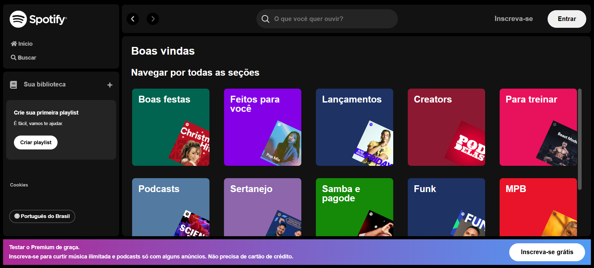

# 🎵 Spotify Imersão Alura

Bem-vindo ao **Spotify Imersão Alura**! Este projeto foi desenvolvido durante a imersão promovida pela **Alura** entre os dias 24/01/2025 a 04/02/2025, onde exploramos tecnologias web para criar uma aplicação inspirada no Spotify.

## 📌 Sobre o Projeto

O projeto consiste em uma aplicação web que simula algumas funcionalidades do Spotify, como:

- 🔍 Busca de artistas
- 🎶 Exibição de playlists
- 🖼️ Exibição de detalhes do artista (imagem, nome, etc.)
- ⚡ Interface dinâmica com manipulação do DOM

## 🚀 Tecnologias Utilizadas

- **HTML** → Estrutura do projeto
- **CSS** → Estilização da interface
- **JavaScript** → Manipulação do DOM e requisições
- **JSON Server** → Simulação de API para buscar dados
- **Fetch API** → Comunicação com o backend fake

## 📂 Estrutura do Projeto

```
spotify-imersao-alura/

│── api-artists/       # Pasta contendo os dados dos artistas
│   └── artists.json   # Banco de dados fake para o JSON Server
│── src/               # Código-fonte
│   ├── assets/        # Imagens e ícones
│   │   ├── icons/     # Ícones utilizados na aplicação
│   │   └── playlist/  # Imagens dos álbuns dos cantores
│   └── styles/        # Arquivos CSS
│── index.html         # Página principal
│── script.js          # Lógica da aplicação
│── README.md          # Documentação do projeto
```

## 📡 Como Executar o Projeto

1. Clone o repositório:
   ```sh
   git clone https://github.com/Audry-prog/spotify-imersao-alura.git
   ```
2. Acesse a pasta do projeto:
   ```sh
   cd spotify-imersao-alura
   ```
3. Instale o **JSON Server** (caso não tenha):
   ```sh
   npm install -g json-server
   ```
4. Inicie o **JSON Server** para servir os dados do artists.`json`:
   ```sh
   json-server --watch api-artists/artists.json --port 3000
   ```
5. Abra o arquivo `index.html` no navegador ou utilize uma extensão como **Live Server** no VS Code.

## 📢 Funcionalidades

✔️ Busca artistas por nome ✔️ Filtra artistas na API fake com `name_like` ✔️ Exibe informações detalhadas do artista ✔️ Alterna entre lista de artistas e detalhes ✔️ Estilização dinâmica baseada na interação do usuário

## 📷 Print da Tela do Projeto



## 📜 Licença

Este projeto foi desenvolvido para fins educacionais durante a imersão da Alura. Sinta-se à vontade para explorar. 🎵🚀

---

💡 **Dúvidas ou sugestões?** Contribua com o projeto ou entre em contato! 😃